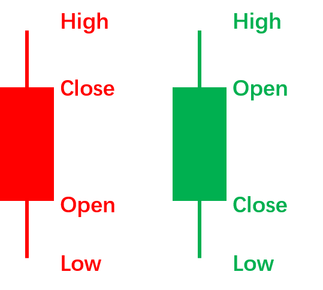
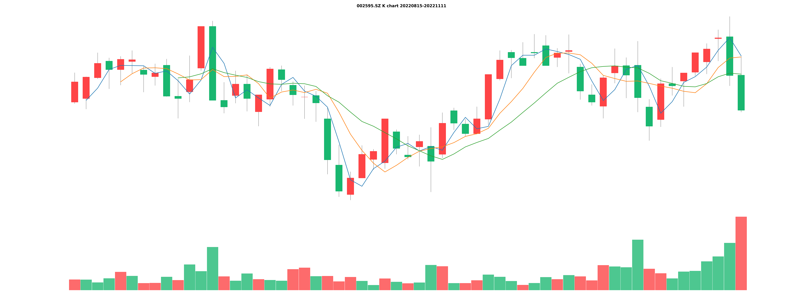
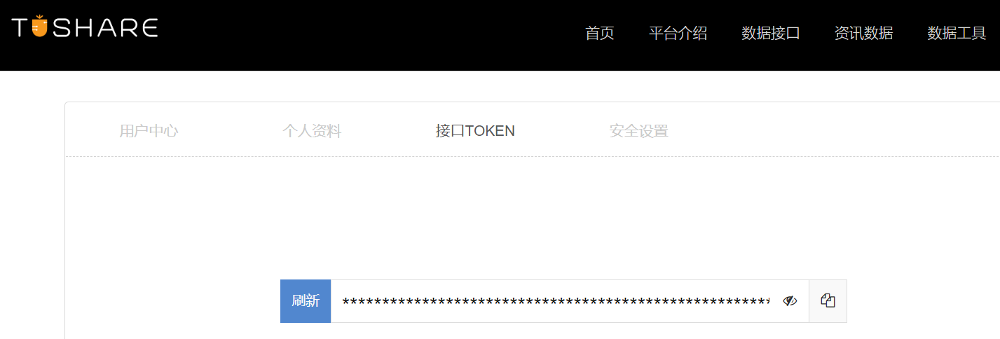
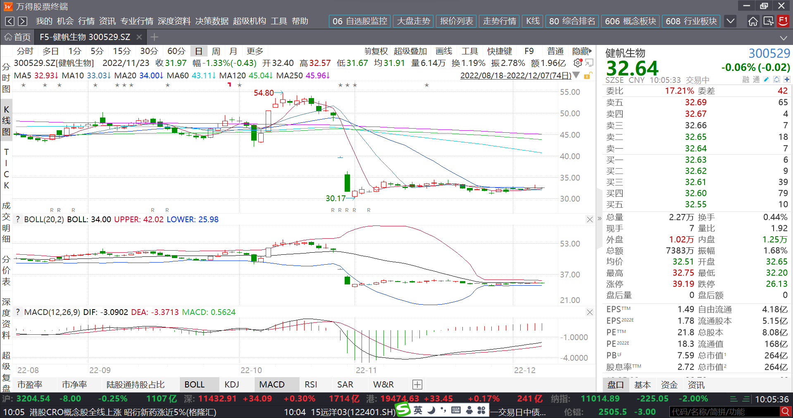
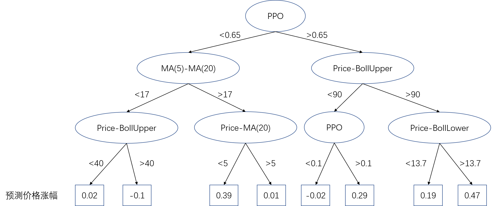
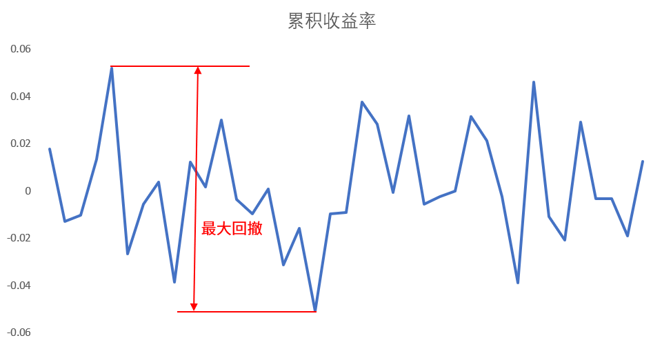

&#8195;&#8195;这是一个demo程序，旨在帮大家快速入门基于机器学习的量化投资方法。适于人群：有一定python基础，对炒股和量化投资一无所知的人。  
&#8195;&#8195;所谓量化投资，指根据资产的各方面数据表现，通过<b>程序化</b>的策略或模型来判断在什么时间进行买入或卖出，可以取得最大的收益。这里我们以A股市场为例。
&#8195;&#8195;量化投资是跟随趋势，而非创建趋势，尽可能在趋势的早期发现它，在趋势中获利。有些庄家通过连续地下大单买入，让散户跟随，从而拉升股份，这是在创造趋势。
# 运行程序
&#8195;&#8195;首先，通过以下命令安装必需的python依赖库。
```shell
pip install -r requirements.txt
```
1. 调用tusare，获取股票的历史价格数据。每支股票的数据会保存在file/data目录下，所有股票的代码保存在文件file/stock_list.txt中，作为demo我只往里面放了10支股票，实战中应该尽可能地多放一些。  
   `python data.py`
2. 根据基础的价格数据，生成机器学习模型所需要的高级特征。最终的特征文件是pickle二进制格式，存放在目录file/feature下。  
   `python feature.py`
3. 训练lightGBM模型。模型文件是file/model.lgb.txt。  
   `python model.py`
4. 根据历史数据回测模型效果。每天应该买入哪支股票以及对应的收益会存储在文件file/record.csv中，同时会计算量化投资最经常关注的三个指标：累积收益、最大回撤、夏普率。  
   `python backtest.py`

&#8195;&#8195;以上4步也可以通过执行`python main.py`一次性完成。
# 数据
&#8195;&#8195;我们需要搜集哪些信息来及时地发现趋势？影响股价的因素是多方面的，财报、公司新闻、市场情绪等等，作为demo这里只使用股票最近一段时间的OHLC，即Open开盘价、High最高价、Low最低价、Close收盘价。股价在一天之内是不断变化的，其最高点和最低点分别是High和Low，9:30开盘时的价格是Open，15:00收盘时的价格是Close。把OHLC画成一个柱状图，把多天的柱状图从左到右依次排列在画布上就是k线图。  
  
&#8195;&#8195;Close大于Open说明当天是上涨的，反之代表下跌。国外用绿色的柱状图表示上涨，红色的柱状图表示下跌（红灯停绿灯行）；国内红色表示喜庆，所以用红色表示上涨，绿色表示下跌。  
  
&#8195;&#8195;获取股票数据的python库有很多，经过各种踩坑我最终还是选择了<a href=https://tushare.pro>TuShare</a>。注册TuShare后会得到一个token，系统根据token对调用方进行身份的识别，有免费版，付费版也划分了多个档次，显然付费越多可调用的接口就越多，调用频率就越高。  
  
&#8195;&#8195;如果在T时刻出现了送股、配股等情况，为保证公司的总市值不变，股价要调低。前复权指调整T时刻之前的价格使k线连续。后复权指调整T时刻之后的价格使k线连续。后复权不需要改动历史数据，便于操作，所以量化投资都使用后复权数据。（使用不复权的数据行不行？不行）
# 特征
&#8195;&#8195;使用哪些特征有助于机器学习模型更准确地预测股价的涨跌呢？随便打开一个炒股软件，k线图上会叠加各种各样的图表和曲线，这些指标我们应该认真学习，把它们用到机器学习模型里面来。  

&#8195;&#8195;作为demo程序我们只使用3种基础的指标：移动平均(MA, Moving Average)、MACD(Moving Average Convergence/Divergence Oscillator)和布林带(Bollinger Bands)。  
&#8195;&#8195;MA(n)表示过去n天(包括当天)的平均值取代当前值，n取1时MA曲线跟原始的价格曲线重合。MA是对上下波动的价格曲线进行了平滑，通过MA更容易看清整体的趋势，同时也带来了滞后性。n越大曲线越平滑，滞后性也越严重，即转向越迟钝。n比较小的曲线称之为MA快线，n比较大的曲线称之为MA慢线，快线与慢线的差称之为<b>动量指标</b>，动量反应的是价格近期的变化速度。速度对于预测未来价格的走势是有意义的！速度为正，未来的股价应该会上涨，速度越大上涨得越多。我们要预测的不是股价上涨的绝对值，而是股价上涨的百分比，因为你手里的可用资金是固定的。所以我们会让速度再除以当前的价格。  
&#8195;&#8195;MACD线就是MA的快线减慢线，不同股票对比时应该再除以价格。代码中没有使用MACD，而是使用的PPO(Percentage Price Oscillator)，就是在MACD的基础上除了慢线。  
&#8195;&#8195;布林带由3条线构成：中线、上限和下限。中线就是近期的移动平均，再算出近期价格波动的标准差，中线加/减m倍的标准差就是得到了上限和下限。大部分情况下价格游走于上限和下限构成的边界之内，价格接近甚至超出边界是一个比较强的信号，对预测股价未来的走势是有帮助的。   
&#8195;&#8195;我们并不需要像<a href="https://baike.baidu.com/item/%E5%9B%BE%E8%A1%A8%E4%B8%93%E5%AE%B6/7171011">图表专家</a>那样把非常复杂的指标进行组合，然后用代码进行刻画，最终喂给机器学习模型。机器学习模型可以自动地进行特征的组合、阈值的选择。    
&#8195;&#8195;你可能经常听到有人说<i>寻找alpha</i>，其实就是寻找跟市场牛熊无关的可以稳定盈利的因子。通过少数几个关键因子实现盈利是比较困难的，而且因子一旦泄漏给多数人它就失效了。机器学习的优势就在于它不需要特别高级复杂的因子，但它对多个因子进行了复杂的组合，所以不存在因子泄漏的问题(除非模型文件泄漏)。
# 模型
&#8195;&#8195;根据我多年的从业经验，工业界最接近“万能模型”这个称号的就是lightGBM，遇到任何问题都可以先试一下这个模型。简单来说它是一个决策树模型，最终它会根据历史数据学习出下图所示的预测树。  

&#8195;&#8195;三个臭皮匠顶个诸葛亮，你可能觉得一棵决策树预测得不准，lightGBM允许你训练很多棵决策树共同参与预测。每棵树越深代表条件组合得越复杂。越复杂不代表就能预测得越准，所以你要反复地调整参数，找到尽可能最优的方案。对于lightGBM模型影响最大的三个参数就是：学习率、树的个数、每棵树的深度。
# 回测
&#8195;&#8195;回测就是用已经发生的历史数据来验证模型的效果，注意这里的“历史数据”和训练模型时使用的“历史数据”一定不能存在交集，因为机器学习模型对它“见过的数据”（训练集）有很强的记忆性，如果把这些数据再拿来作预测那么预测得会很准。预测“未见过的数据”才代表了模型的真实水平。在代码中我们用T时刻之前的数据作训练集，用T时刻之后的数据作测试集。    
&#8195;&#8195;模型的效果用什么衡量呢？我们对模型的期待是多方面的，最重要的当然是累积收益率，比如回测了一年的数据，这一年下来累积的收益能到多少无疑是投资者最关心的。  
&#8195;&#8195;同时我们对收益率的波动是厌恶的，方差是刻画波动的统计量，夏普率就是收益率的期望除以其方差（不严谨地讲）。  
&#8195;&#8195;在实际操盘的过程中如果收益持续地下降，那么操盘者的心理素质可能承受不了，甚至他会怀疑代码哪里出了问题，从而放弃量化投资策略。T时刻的累积收益跟T时刻之前的累积收益最高点之差称为回撤，每一个时刻都对应一个回撤值，回测期间的最大回撤也是经常被关注的一个指标。  

&#8195;&#8195;收益除了跟模型有关，跟交易方式也有关，在demo代码中每天开盘时选择一支预测得分最高的股票买入，同时卖出上一个交易日买入的股票。你也可以每次交易三支股票，或者每周交易一次，或者始终持仓50支股票每天卖出3支再买入3支，等等等等，交易方式不同，对应的模型训练目标也不同。  
&#8195;&#8195;有很多成熟的回测框架，比如<a href="https://www.vnpy.com/">vnpy</a>, <a href="https://www.backtrader.com/">backtrader</a>等等。
# 实际情况是什么
&#8195;&#8195;到这里，你对基于机器学习的量化投资方法已经有了整体的了解，离真的赚钱还有很多工作需要完善。如果你有志于在这个方向深入探索，根据我多年的踩坑经验，我认为你应该重点关注以下3个方面：  
1. 数据的正确性。调外部接口获取数据时，<b>所有</b>异常一定要及时报警。运用多线程/多进程技术提高代码的执行速度。最重要的一点--防止特征穿越！特征穿越指你在T时刻执行预测时用到了T时刻之后的特征，这在实际操盘的时候当然不可能发生，但在训练模型的时候是可能发生的，比如在预测2020-06-01开盘应该买哪支股票时把2020-06-01当天上证指数的涨幅作为特征喂给了模型。特征穿越可能会使模型的回测效果异常地好，比如一年几百倍几千倍的收益。有时候回测效果一般不代表不存在特征穿越的问题，你应该把实际操盘时模型的输入(即特征)和输出(即score)都保存下来，过几天再用回测的代码跑一遍，看看特征值和score是否跟之前的一致。  
2. 特征，或者叫因子。把你能想到的特征尽可能都喂给模型，如果你用lightGBM模型特征应该达到几百个。你可以从<a href="https://arxiv.org/ftp/arxiv/papers/1601/1601.00991.pdf">Alpha101</a>开始，微软的<a href="https://qlib.readthedocs.io/en/latest/index.html">Qlib</a>项目里提供了Alpha158和Alpha360两套特征库的实现。模型会自己判断特征的重要度，所以你不用担心把无效特征喂给模型。如果你发现随着特征的增多模型效果在下降，那应该是训练过程有问题或者数据量不够。
3. 模型的目标函数。对于拟合问题默认的目标是减小拟合误差的平方，但是你要考虑以下几种情况是否应该平等对待。  

|实际涨幅|预测涨幅|差值|
|:--:|:--:|:--:|
|0.1|0.3|-0.2|
|0.3|0.1|0.2|
|0.1|-0.1|0.2|
|-0.1|-0.3|0.2|
|-0.1|0.1|-0.2|  

&#8195;&#8195;好了，本想抛砖引玉，也不怕贻笑大方，欢迎各位同仁与我联系，共同交流学习~